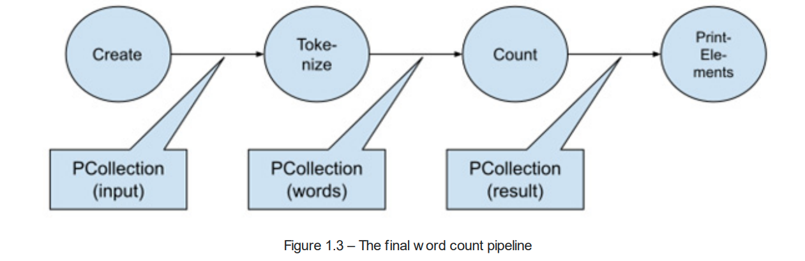

## Let's start a sample pipeline    

```java
public class FirstPipeline {

  public static void main(String[] args) throws IOException {

    // read some input from text file
    ClassLoader loader = Chapter1Demo.class.getClassLoader();
    String fileUrl = Objects.requireNonNull(loader.getResource("lorem.txt")).toString();
    System.out.println("Reading file from: " + fileUrl);
    URI fileUri;
    try {
      fileUri = new URI(fileUrl);
    } catch (URISyntaxException e) {
      throw new IOException("Invalid URI", e);
    }
    Path filePath = Paths.get(fileUri);
    List<String> lines = Files.readAllLines(filePath, StandardCharsets.UTF_8);

    // create empty Pipeline
    // A Pipeline is a container for both data (PCollection)
    // and operations (PTransforms)
    Pipeline pipeline = Pipeline.create();

    // transform 'lines' into PCollection
    PCollection<String> input = pipeline.apply(Create.of(lines));

    // tokenize the input into words
    PCollection<String> words = input.apply(Tokenize.of());

    // count each occurrence of a word
    PCollection<KV<String, Long>> result = words.apply(Count.perElement());

    // print the contents of PCollection 'result' to standard out
    result.apply(PrintElements.of());

    // run the Pipeline
    pipeline.run().waitUntilFinish();
  }
}
```

this will output 
```bash
KV{mollit, 1}
KV{cupidatat, 1}
KV{inceptos, 1}
KV{id, 3}
KV{Cum, 1}
KV{impedit, 1}
KV{vehicula, 1}
KV{numquam, 1}
KV{quaerat, 1}
KV{omnis, 2}
KV{per, 2}
KV{convallis, 1}
KV{volutpat, 3}
KV{Cras, 1}
KV{elit, 2}
KV{proident, 1}
KV{Maecenas, 1}
KV{nonummy, 1}
KV{Nulla, 1}
KV{Etiam, 1}
KV{cum, 1}
KV{quia, 2}
KV{aptent, 1}
KV{pellentesque, 2}
KV{dolor, 3}
KV{maxime, 1}
KV{ipsum, 2}
KV{taciti, 1}
KV{culpa, 1}
KV{ac, 1}
KV{ad, 1}
KV{anim, 1}
KV{metus, 2}
KV{conubia, 1}
KV{magnis, 1}
KV{ridiculus, 1}
KV{Sed, 1}
KV{vestibulum, 1}
KV{diam, 1}
KV{in, 5}
KV{repellendus, 1}
KV{velit, 3}
KV{pulvinar, 1}
KV{optio, 1}
KV{assumenda, 1}
KV{sem, 3}
KV{adipisci, 1}
KV{penatibus, 1}
KV{elementum, 2}
KV{officia, 1}
KV{Excepteur, 1}
KV{cumque, 1}
KV{Lorem, 1}
KV{dis, 1}
KV{a, 3}
KV{ante, 2}
KV{turpis, 1}
KV{quam, 2}
KV{ornare, 1}
KV{deserunt, 1}
KV{Aliquam, 4}
KV{parturient, 1}
KV{sociosqu, 1}
KV{ullamcorper, 1}
KV{tempora, 1}
KV{magna, 1}
KV{nisl, 1}
KV{aliquam, 1}
KV{minus, 1}
KV{mauris, 2}
KV{Vestibulum, 1}
KV{sagittis, 1}
KV{arcu, 2}
KV{odio, 1}
KV{magnam, 1}
KV{rutrum, 1}
KV{laborum, 1}
KV{erat, 4}
KV{tempore, 1}
KV{sunt, 1}
KV{nec, 1}
KV{sed, 2}
KV{eius, 1}
KV{In, 2}
KV{est, 4}
KV{Mauris, 1}
KV{torquent, 1}
KV{sint, 1}
KV{eligendi, 1}
KV{quis, 2}
KV{hymenaeos, 1}
KV{occaecat, 1}
KV{suscipit, 1}
KV{interdum, 1}
KV{sapien, 1}
KV{porro, 1}
KV{vel, 2}
KV{nascetur, 1}
KV{non, 5}
KV{imperdiet, 2}
KV{enim, 3}
KV{malesuada, 4}
KV{molestie, 1}
KV{Phasellus, 1}
KV{Fusce, 1}
KV{ut, 1}
KV{quod, 1}
KV{voluptas, 1}
KV{fermentum, 2}
KV{porta, 1}
KV{eu, 2}
KV{litora, 1}
KV{sociis, 1}
KV{quisquam, 1}
KV{mus, 1}
KV{soluta, 1}
KV{montes, 1}
KV{vitae, 3}
KV{Curabitur, 1}
KV{nostra, 1}
KV{massa, 1}
KV{natoque, 1}
KV{sit, 2}
KV{incidunt, 1}
KV{consectetur, 1}
KV{quo, 1}
KV{facere, 1}
KV{Nam, 2}
KV{eget, 1}
KV{adipiscing, 1}
KV{lectus, 2}
KV{possimus, 1}
KV{tortor, 1}
KV{wisi, 1}
KV{rhoncus, 1}
KV{Duis, 1}
KV{Aenean, 1}
KV{nobis, 1}
KV{lacinia, 1}
KV{voluptatem, 1}
KV{Integer, 2}
KV{dolore, 1}
KV{dui, 1}
KV{dolorem, 1}
KV{et, 2}
KV{Neque, 1}
KV{placeat, 1}
KV{amet, 2}
KV{libero, 2}
KV{pharetra, 2}
KV{modi, 1}
KV{labore, 1}
KV{nulla, 2}
KV{Class, 1}
KV{consectetuer, 1}
KV{nihil, 1}
KV{Quisque, 1}
KV{qui, 2}
```

